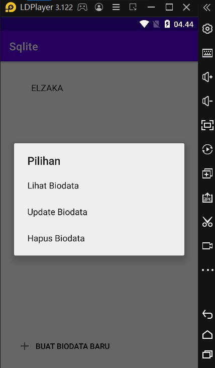
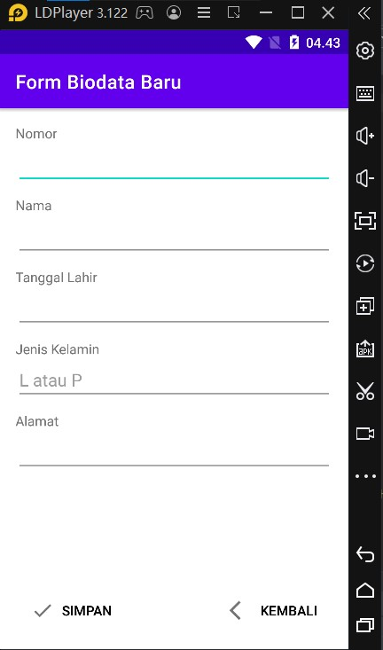
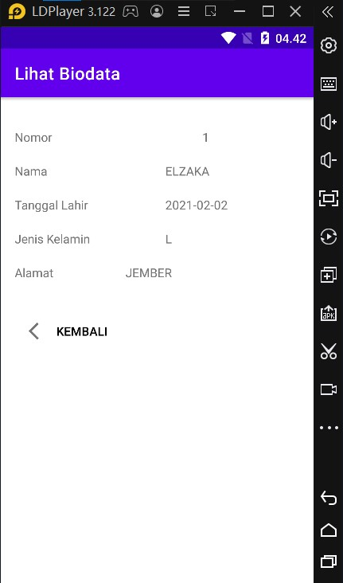
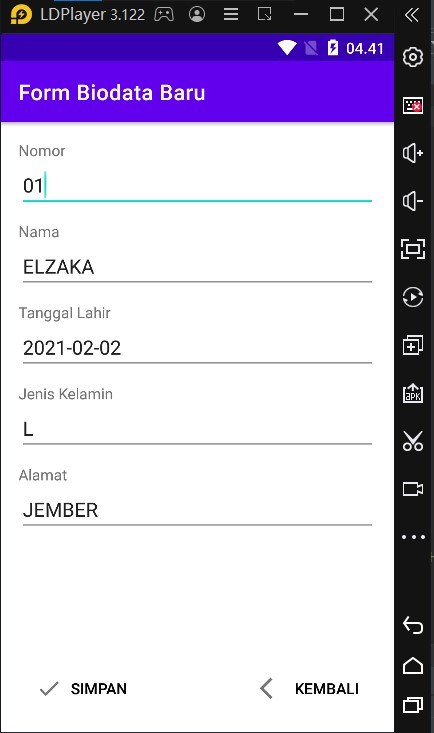
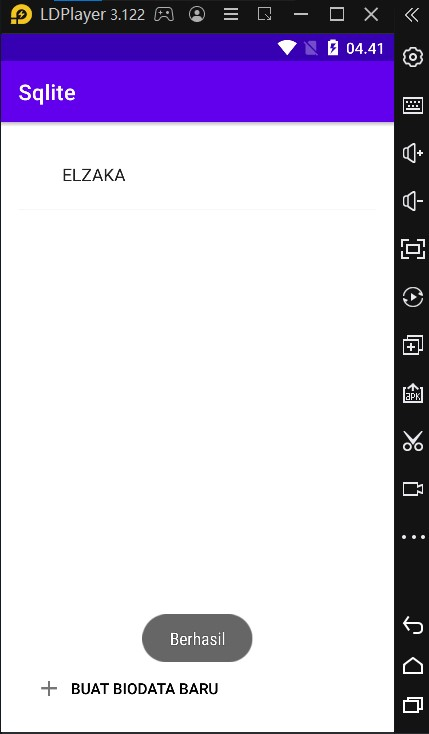

# Nama : E41202429 / AZRIL NUR RAHMAN
Implementasi SQLite

<h4>1. Menu Utama</h4>

<h4>2. Tambah Biodata </h4>

<h4>3. Lihat Biodata </h4>

<h4>4. Update Biodata </h4>

<h4>5. Berhasil Update & Tambah Biodata </h4>

